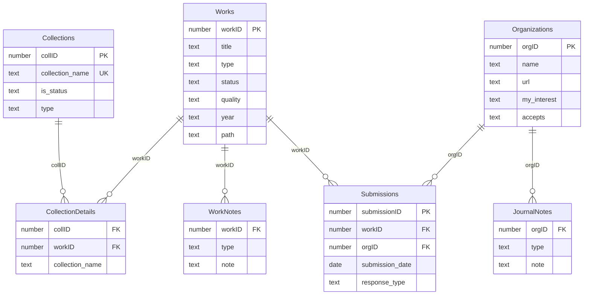

# Relationships Specification

> **Document:** 02-relationships.md  
> **Parent:** [specification.md](specification.md)  
> **Version:** 1.0

---

## Table of Contents

1. [Relationship Overview](#1-relationship-overview)
2. [Entity Relationship Diagram](#2-entity-relationship-diagram)
3. [Relationship Details](#3-relationship-details)
4. [Foreign Key Constraints](#4-foreign-key-constraints)
5. [Cascade Behaviors](#5-cascade-behaviors)
6. [Sort Orders](#6-sort-orders)

---

## 1. Relationship Overview

The database uses 6 primary relationships connecting 7 tables:

| Relationship | Type | Description |
|--------------|------|-------------|
| Collections ↔ CollectionDetails | One-to-Many | Collection contains many detail records |
| Works ↔ CollectionDetails | One-to-Many | Work can be in many collections |
| Works ↔ Submissions | One-to-Many | Work can have many submissions |
| Works ↔ Work Notes | One-to-Many | Work can have many notes |
| Organizations ↔ Submissions | One-to-Many | Organization receives many submissions |
| Organizations ↔ Journal Notes | One-to-Many | Organization can have many notes |

### Implicit Many-to-Many

The **Collections ↔ Works** relationship is many-to-many, implemented via the **CollectionDetails** join table:

```
Collections ──< CollectionDetails >── Works
```

A work can belong to multiple collections (e.g., "Working" status AND "Spiral" project).
A collection can contain multiple works.

---

## 2. Entity Relationship Diagram

### 2.1 Mermaid Diagram



### 2.2 ASCII Diagram

```
┌─────────────────────────────────────────────────────────────────────────────────┐
│                              RELATIONSHIP DIAGRAM                                │
├─────────────────────────────────────────────────────────────────────────────────┤
│                                                                                 │
│  ┌─────────────┐                                         ┌─────────────┐       │
│  │ Collections │                                         │    Works    │       │
│  ├─────────────┤                                         ├─────────────┤       │
│  │ collID (PK) │──────────┐                   ┌──────────│ workID (PK) │       │
│  │ name        │          │                   │          │ title       │       │
│  │ isStatus    │          │                   │          │ type        │       │
│  │ type        │          │                   │          │ status      │       │
│  └─────────────┘          │                   │          │ quality     │       │
│                           │                   │          └──────┬──────┘       │
│                           ▼                   ▼                 │              │
│                    ┌──────────────────────────────┐             │              │
│                    │      CollectionDetails       │             │              │
│                    ├──────────────────────────────┤             │              │
│                    │ collID (FK)                  │             │              │
│                    │ workID (FK)                  │             │              │
│                    │ collection_name              │             │              │
│                    └──────────────────────────────┘             │              │
│                                                                 │              │
│       ┌─────────────────────────────────────────────────────────┤              │
│       │                         │                               │              │
│       ▼                         ▼                               ▼              │
│ ┌────────────┐          ┌─────────────┐                 ┌────────────┐        │
│ │ Work Notes │          │ Submissions │                 │Organizations│        │
│ ├────────────┤          ├─────────────┤                 ├────────────┤        │
│ │ workID(FK) │          │submissionID │                 │ orgID (PK) │        │
│ │ type       │          │ workID (FK) │─────────────────│ name       │        │
│ │ note       │          │ orgID (FK)  │                 │ url        │        │
│ │ date       │          │ sub_date    │                 │ interest   │        │
│ └────────────┘          │ resp_type   │                 └─────┬──────┘        │
│                         └─────────────┘                       │               │
│                                                                ▼               │
│                                                        ┌──────────────┐       │
│                                                        │Journal Notes │       │
│                                                        ├──────────────┤       │
│                                                        │ orgID (FK)   │       │
│                                                        │ type         │       │
│                                                        │ note         │       │
│                                                        └──────────────┘       │
│                                                                                 │
└─────────────────────────────────────────────────────────────────────────────────┘
```

---

## 3. Relationship Details

### 3.1 Collections = CollectionDetails

**Purpose:** Links collections to their member records in the join table.

| Property | Left (Collections) | Right (CollectionDetails) |
|----------|-------------------|---------------------------|
| **Table** | Collections | CollectionDetails |
| **Key Field** | collID | collID |
| **Cardinality** | One | Many |
| **Allow Create** | No | No |
| **Delete Cascade** | No | No |
| **Sort Order** | None | None |

### 3.2 CollectionDetails = Works

**Purpose:** Links join table records to their associated works.

| Property | Left (CollectionDetails) | Right (Works) |
|----------|-------------------------|---------------|
| **Table** | CollectionDetails | Works |
| **Key Field** | WorkID | workID |
| **Cardinality** | Many | One |
| **Allow Create** | Yes | No |
| **Delete Cascade** | Yes | No |
| **Sort Order** | Collection Name (asc) | Status, Quality, Type, Title (custom) |

**Sort Order for Works (accessed via CollectionDetails):**
1. Status - custom order per StatusList
2. Quality - custom order per QualityList  
3. Type - custom order per WorkType
4. Title - ascending alphabetical

### 3.3 Works = Submissions

**Purpose:** Links works to their submission history.

| Property | Left (Works) | Right (Submissions) |
|----------|-------------|---------------------|
| **Table** | Works | Submissions |
| **Key Field** | workID | workID |
| **Cardinality** | One | Many |
| **Allow Create** | No | Yes |
| **Delete Cascade** | No | No |
| **Sort Order** | None | Response Date (desc), Submission Date (desc) |

### 3.4 Works = Work Notes

**Purpose:** Links works to their notes, critiques, and history.

| Property | Left (Works) | Right (Work Notes) |
|----------|-------------|-------------------|
| **Table** | Works | Work Notes |
| **Key Field** | workID | workID |
| **Cardinality** | One | Many |
| **Allow Create** | No | Yes |
| **Delete Cascade** | No | Yes |
| **Sort Order** | None | None |

### 3.5 Organizations = Submissions

**Purpose:** Links organizations to submissions they received.

| Property | Left (Organizations) | Right (Submissions) |
|----------|---------------------|---------------------|
| **Table** | Organizations | Submissions |
| **Key Field** | orgID | orgID |
| **Cardinality** | One | Many |
| **Allow Create** | No | No |
| **Delete Cascade** | No | No |
| **Sort Order** | None | None |

### 3.6 Organizations = Journal Notes

**Purpose:** Links organizations to notes about them.

| Property | Left (Organizations) | Right (Journal Notes) |
|----------|---------------------|----------------------|
| **Table** | Organizations | Journal Notes |
| **Key Field** | orgID | orgID |
| **Cardinality** | One | Many |
| **Allow Create** | No | Yes |
| **Delete Cascade** | No | Yes |
| **Sort Order** | None | None |

---

## 4. Foreign Key Constraints

### 4.1 Required Foreign Keys

| Table | Foreign Key | References | Required |
|-------|-------------|------------|----------|
| CollectionDetails | collID | Collections.collID | Yes |
| CollectionDetails | workID | Works.workID | Yes |
| Submissions | workID | Works.workID | Yes |
| Submissions | orgID | Organizations.orgID | Yes |
| Work Notes | workID | Works.workID | Yes |
| Journal Notes | orgID | Organizations.orgID | Yes |

### 4.2 Referential Integrity

All foreign keys should enforce referential integrity:

```sql
-- SQLite foreign key enforcement
PRAGMA foreign_keys = ON;
```

---

## 5. Cascade Behaviors

### 5.1 Delete Cascade Matrix

| When Deleted | Also Delete | Behavior |
|--------------|-------------|----------|
| Work | Work Notes | **CASCADE** - Delete all notes for this work |
| Work | CollectionDetails | **CASCADE** - Remove from all collections |
| Work | Submissions | **NO CASCADE** - Keep submission history |
| Organization | Journal Notes | **CASCADE** - Delete all notes for this org |
| Organization | Submissions | **NO CASCADE** - Keep submission history |
| Collection | CollectionDetails | **NO CASCADE** - Keep membership records |

### 5.2 Implementation in SQLite

```sql
-- CollectionDetails with cascade on work delete
CREATE TABLE CollectionDetails (
    id INTEGER PRIMARY KEY,
    collID INTEGER NOT NULL,
    workID INTEGER NOT NULL,
    collection_name TEXT,
    FOREIGN KEY (collID) REFERENCES Collections(collID),
    FOREIGN KEY (workID) REFERENCES Works(workID) ON DELETE CASCADE
);

-- Work Notes with cascade
CREATE TABLE WorkNotes (
    id INTEGER PRIMARY KEY,
    workID INTEGER NOT NULL,
    type TEXT,
    note TEXT,
    modified_date TEXT,
    FOREIGN KEY (workID) REFERENCES Works(workID) ON DELETE CASCADE
);

-- Journal Notes with cascade
CREATE TABLE JournalNotes (
    id INTEGER PRIMARY KEY,
    orgID INTEGER NOT NULL,
    type TEXT,
    note TEXT,
    modified_date TEXT,
    FOREIGN KEY (orgID) REFERENCES Organizations(orgID) ON DELETE CASCADE
);
```

---

## 6. Sort Orders

### 6.1 Custom Value List Orders

Several relationships use custom sort orders based on value lists. These must be implemented as CASE expressions in SQL:

#### StatusList Order
```sql
CASE status
    WHEN 'Out' THEN 1
    WHEN 'Focus' THEN 2
    WHEN 'Active' THEN 3
    WHEN 'Working' THEN 4
    WHEN 'Resting' THEN 5
    WHEN 'Waiting' THEN 6
    WHEN 'Gestating' THEN 7
    WHEN 'Sound' THEN 8
    WHEN 'Published' THEN 9
    WHEN 'Sleeping' THEN 10
    WHEN 'Dying' THEN 11
    WHEN 'Dead' THEN 12
    WHEN 'Done' THEN 13
    ELSE 99
END
```

#### QualityList Order
```sql
CASE quality
    WHEN 'Best' THEN 1
    WHEN 'Better' THEN 2
    WHEN 'Good' THEN 3
    WHEN 'Okay' THEN 4
    WHEN 'Poor' THEN 5
    WHEN 'Bad' THEN 6
    WHEN 'Worst' THEN 7
    WHEN 'Unknown' THEN 8
    ELSE 99
END
```

#### WorkType Order
```sql
CASE type
    WHEN 'Article' THEN 1
    WHEN 'Book' THEN 2
    WHEN 'Chapter' THEN 3
    WHEN 'Critique' THEN 4
    WHEN 'Essay' THEN 5
    WHEN 'Flash' THEN 6
    WHEN 'Interview' THEN 7
    WHEN 'Freewrite' THEN 8
    WHEN 'Journal' THEN 9
    WHEN 'Micro' THEN 10
    WHEN 'Poem' THEN 11
    WHEN 'Paper' THEN 12
    WHEN 'Lesson' THEN 13
    WHEN 'Character' THEN 14
    WHEN 'Research' THEN 15
    WHEN 'Review' THEN 16
    WHEN 'Song' THEN 17
    WHEN 'Story' THEN 18
    WHEN 'Travel' THEN 19
    ELSE 99
END
```

### 6.2 Standard Sort Queries

#### Works in a Collection
```sql
SELECT w.* 
FROM Works w
JOIN CollectionDetails cd ON w.workID = cd.workID
WHERE cd.collID = ?
ORDER BY 
    CASE w.status WHEN 'Out' THEN 1 WHEN 'Focus' THEN 2 ... END,
    CASE w.quality WHEN 'Best' THEN 1 WHEN 'Better' THEN 2 ... END,
    CASE w.type WHEN 'Article' THEN 1 WHEN 'Book' THEN 2 ... END,
    w.title ASC;
```

#### Submissions for a Work
```sql
SELECT s.*, o.name as journal_name
FROM Submissions s
JOIN Organizations o ON s.orgID = o.orgID
WHERE s.workID = ?
ORDER BY s.response_date DESC, s.submission_date DESC;
```

---

*End of Relationships Specification*
